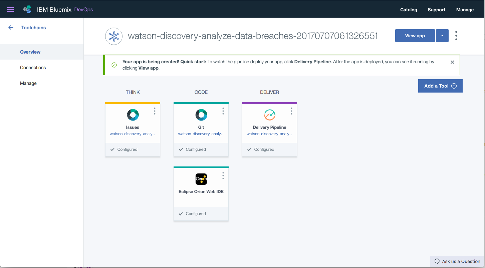
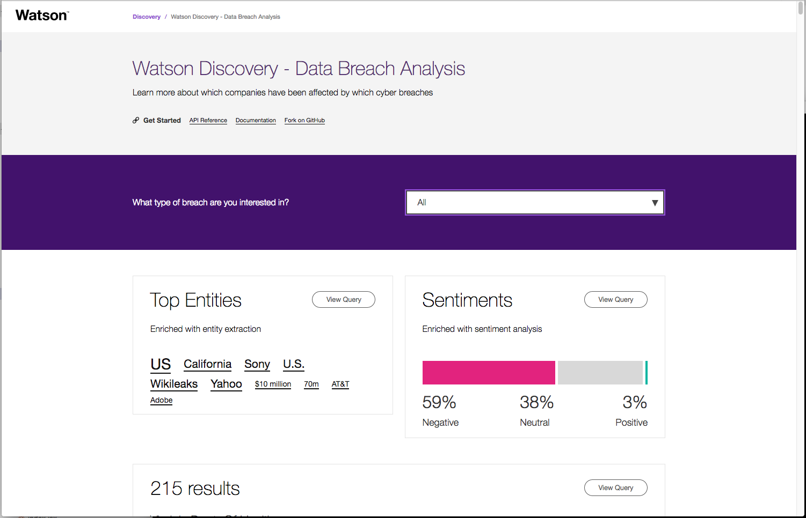

[](https://travis-ci.org/IBM/watson-discovery-analyze-data-breaches)


# Use the Watson Discovery Service to analyze cyber security breaches

In this Code Pattern you will upload your own data into the Watson Discovery Service. Then you'll configure a web application so that it can query the data collection you created. The web app allows you to explore that data.

Once you have completed this Code Pattern, you will know how to:

* Build and run a Node.js API server with a HTML frontend written in React
* Configure Watson Discovery to build and enrich private data collections
* Use Watson Discovery to query and analyze data


## Flow
1. The **cyber breach** json files are added to the Discovery collection.
2. The user interacts with the backend server via the app UI. The frontend app UI uses React to render search results and can reuse all of the views that are used by the backend for server side rendering. The frontend is using watson-react-components and is responsive.
3. User input is processed and routed to the backend server, which is responsible for server side rendering of the views to be displayed on the browser. The backend server is written using express and uses express-react-views engine to render views written using React.
4. The backend server sends user requests to the Watson Discovery Service. It acts as a proxy server, forwarding queries from the frontend to the Watson Discovery Service API while keeping sensitive API keys concealed from the user.

# Included components

* [Watson Discovery](https://www.ibm.com/watson/developercloud/discovery.html): A cognitive search and content analytics engine for applications to identify patterns, trends, and actionable insights.

# Featured technologies

* [Node.js](https://nodejs.org/en/) - An asynchronous event driven JavaScript runtime, designed to build scalable applications
* [React](https://facebook.github.io/react/) - Javascript library for building User Interfaces
* [Express](https://expressjs.com) - A popular and minimalistic web framework for creating API and Web server

# Watch the Video

[](https://youtu.be/zAu9tHefdDc)

# Steps

Use the ``Deploy to IBM Cloud`` button **OR** create the services and run locally.

## Deploy to IBM Cloud
[](https://bluemix.net/deploy?repository=https://github.com/IBM/watson-discovery-analyze-data-breaches.git)

1. Press the above ``Deploy to IBM Cloud`` button and then click on ``Deploy``.

2. In **Toolchains**, click on **Delivery Pipeline** to watch while the app is deployed. Once deployed, the app can be viewed by clicking **View app**.

<p align="center">
  
</p>

3. To see the app and services created and configured for this Code Pattern, use the IBM Cloud dashboard. The app is named `watson-data-breaches` with a unique suffix. The following services are created:

    * breaches-discovery-service

## Run locally
> NOTE: These steps are only needed when running locally instead of using the ``Deploy to IBM Cloud`` button.

1. [Clone the repo](#1-clone-the-repo)
2. [Create IBM Cloud services](#2-create-ibm-cloud-services)
3. [Load the Discovery files](#3-load-the-discovery-files)
4. [Configure credentials](#4-configure-credentials)
5. [Run the application](#5-run-the-application)

## 1. Clone the repo

Clone the `watson-discovery-analyze-data-breaches` repo locally. In a terminal, run:
```
$ git clone https://github.com/ibm/watson-discovery-analyze-data-breaches
```
We'll be using the folder [`data/breaches/`](data/breaches/)

### 2. Create IBM Cloud services

Create the following services:

* [**Watson Discovery**](https://console.ng.bluemix.net/catalog/services/discovery)

### 3. Load the Discovery files

Launch the **Watson Discovery** tool. Create a **new data collection**
and give the data collection a unique name.

<p align="center">
  
</p>

> Save the **environment_id** and **collection_id** for your `.env` file in the next step.

Under `Add data to this collection` use `Drag and drop your documents here or browse from computer` to seed the content with the json files in `data/breaches/`.


### 4. Configure credentials

The credentials for the IBM Cloud Discovery service can be found in the ``Services`` menu in IBM Cloud,
by selecting the ``Service Credentials`` option for the service.

The other settings for Conversation and Discovery were collected during the
earlier setup steps (``DISCOVERY_COLLECTION_ID``, ``DISCOVERY_ENVIRONMENT_ID`` and
``WORKSPACE_ID``).

Copy the [`env.sample`](env.sample) to `.env`.

```
$ cp env.sample .env
```
Edit the `.env` file with the necessary settings.

#### `env.sample:`

```
# Replace the credentials here with your own.
# Rename this file to .env before starting the app.

# Watson Discovery
DISCOVERY_USERNAME=<add_discovery_username>
DISCOVERY_PASSWORD=<add_discovery_password>
DISCOVERY_ENVIRONMENT_ID=<add_discovery_environment>
DISCOVERY_COLLECTION_ID=<add_discovery_collection>

# Run locally on a non-default port (default is 3000)
# PORT=3000
```

### 5. Run the application
1. Install [Node.js](https://nodejs.org/en/) runtime or NPM.
1. Start the app by running `npm install`, followed by `npm start`.
1. Use the chatbot at `localhost:3000`.
> Note: server host can be changed as required in server.js and `PORT` can be set in `.env`.

# Sample output



# Troubleshooting

* Error: Environment {GUID} is still not active, retry once status is active

  > This is common during the first run. The app tries to start before the Discovery environment is fully created. Allow a minute or two to pass. The environment should be usable on restart. If you used `Deploy to IBM Cloud` button the restart should be automatic.

* Error: Only one free environent is allowed per organization

  > To work with a free trial, a small free Discovery environment is created. If you already have a Discovery environment, this will fail. If you are not using Discovery, check for an old service thay you may want to delete. Otherwise use the `.env DISCOVERY_ENVIRONMENT_ID` to tell the app which environment you want it to use. A collection will be created in this environment using the default configuration.

# Privacy Notice

If using the `Deploy to IBM Cloud` button some metrics are tracked, the following information is sent to a [Deployment Tracker](https://github.com/IBM/metrics-tracker-service) service on each deployment:

* Node.js package version
* Node.js repository URL
* Application Name (`application_name`)
* Application GUID (`application_id`)
* Application instance index number (`instance_index`)
* Space ID (`space_id`)
* Application Version (`application_version`)
* Application URIs (`application_uris`)
* Labels of bound services
* Number of instances for each bound service and associated plan information

This data is collected from the `package.json` file in the sample application and the ``VCAP_APPLICATION`` and ``VCAP_SERVICES`` environment variables in IBM Cloud and other Cloud Foundry platforms. This data is used by IBM to track metrics around deployments of sample applications to IBM Cloud to measure the usefulness of our examples, so that we can continuously improve the content we offer to you. Only deployments of sample applications that include code to ping the Deployment Tracker service will be tracked.

## Disabling Deployment Tracking

To disable tracking, simply remove `require("metrics-tracker-client").track();` from the ``app.js`` file in the top level directory.

# Links

* [Demo on Youtube](https://youtu.be/zAu9tHefdDc): Watch the video.
* [Watson Node.js SDK](https://github.com/watson-developer-cloud/node-sdk): Download the Watson Node SDK.
* [Blog: Bring your own data to Watson Discovery Service](doc/index.md): Steps to building the data for this Code Pattern.
* [Data set: World’s biggest data breaches (Information is Beautiful)](http://www.informationisbeautiful.net/visualizations/worlds-biggest-data-breaches-hacks/): Check out the data set used for this Code Pattern, as well as others available for you to use.
* [Watson Discovery, an IBM API adding value to corporate data](https://bbvaopen4u.com/en/actualidad/watson-discovery-ibm-api-adding-value-corporate-data): Dive into IBM Watson Discovery Service, enabling companies to structure and understand large masses of data.
* [Blog: Watson Discovery Service – Understand your data at scale with less effort](https://www.ibm.com/blogs/watson/2016/12/watson-discovery-service-understand-data-scale-less-effort/): Align and connect different data sets to expose critical correlations and causal factors.
* [Blog: Using IBM Watson Discovery to query unstructured data](https://dzone.com/articles/using-ibm-watson-discovery-to-query-unstructured-d): Make sense of and identify patterns in large amounts of unstructured data.

# Learn more

* **Artificial Intelligence Code Patterns**: Enjoyed this Code Pattern? Check out our other [AI Code Patterns](https://developer.ibm.com/code/technologies/artificial-intelligence/).
* **AI and Data Code Pattern Playlist**: Bookmark our [playlist](https://www.youtube.com/playlist?list=PLzUbsvIyrNfknNewObx5N7uGZ5FKH0Fde) with all of our Code Pattern videos
* **With Watson**: Want to take your Watson app to the next level? Looking to utilize Watson Brand assets? [Join the With Watson program](https://www.ibm.com/watson/with-watson/) to leverage exclusive brand, marketing, and tech resources to amplify and accelerate your Watson embedded commercial solution.

# License
[Apache 2.0](LICENSE)
