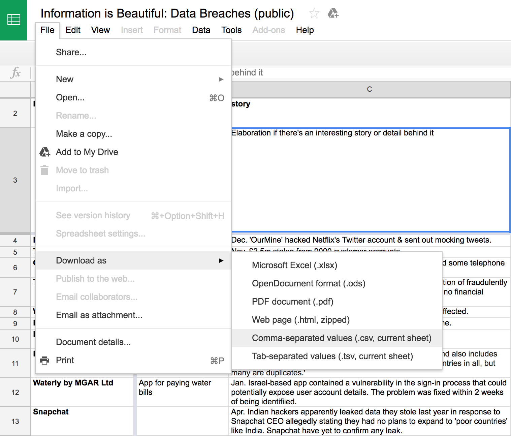
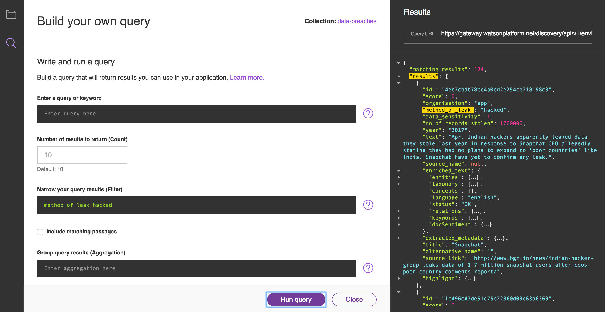
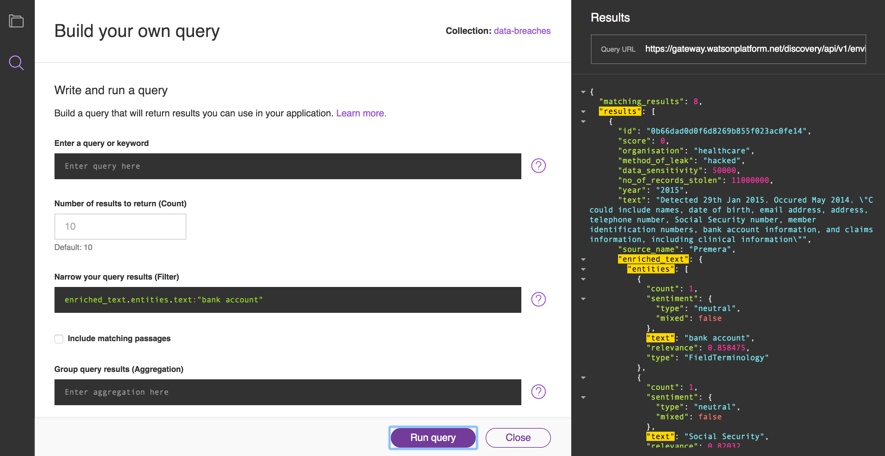
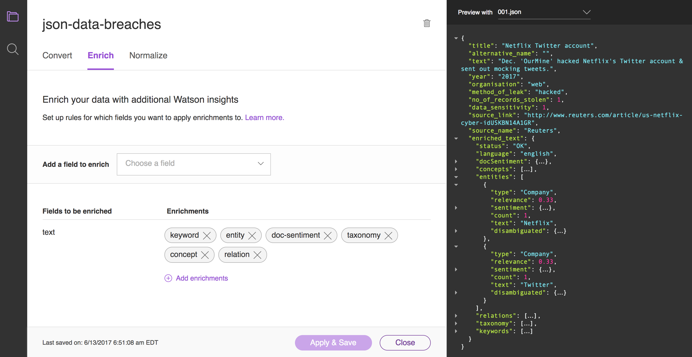
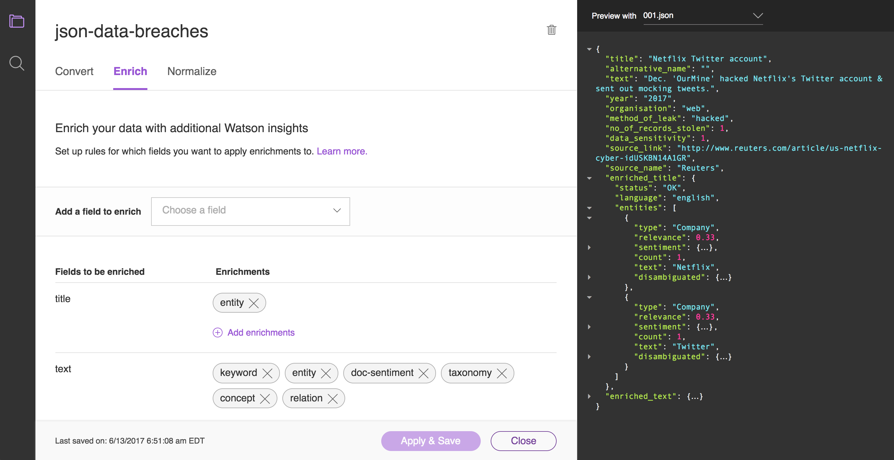

# Bring your own data to Watson Discovery Service

## Overview

The Watson Discovery Service can analyse your data and enrich it, as well as letting you query your data using a cognitive search engine.
[Watson Discovory BYOD][byod] demonstrates how you can build an application using the Watson Discovery Service with your own dataset.
You'll find out how to prepare a dataset of your own so that it can be imported and enriched by the Discovery Service.
And you'll find out how to build a search engine using that dataset.


## Example use case:

* you have a large dataset, with structured fields and free-form text fields
* you want to build an application to allow people to find patterns in that dataset
* users need to be able to filter the data by the existing fields
* additionally, they should be able to filter on fields added by Discovery Service enrichments

## Preparing the dataset

For the [Watson Discovory BYOD][byod] demonstration, we used a public dataset that lists cyber security breaches between 2004 and 2017.
The data is available as a [spreadsheet on Google Docs][spreadsheet].
You can download the dataset as Comma-separated values (CSV), by clicking the **File** menu, then **Download as** then selecting the `.csv` file format.



The Discovery Service can import documents in various formats, including PDFs, Word documents, HTML files, and JSON files.
CSV files are not accepted by the Dicovery Service, so we created a [script to convert the data from CSV to JSON format][convert].
The script creates one JSON file for each row in the CSV file.
You can find the resulting JSON files in [the `data` directory][data] of the Watson Discovery BYOD repository.
Here's an example JSON file:

```json
{
    "title": "Netflix Twitter account",
    "alternative_name": "",
    "text": "Dec. 'OurMine' hacked Netflix's Twitter account & sent out mocking tweets.",
    "year": "2017",
    "organisation": "web",
    "method_of_leak": "hacked",
    "no_of_records_stolen": 1,
    "data_sensitivity": 1,
    "source_link": "http://www.reuters.com/article/us-netflix-cyber-idUSKBN14A1GR",
    "source_name": "Reuters"
}
```

The structure of the CSV file has been preserved, but some of the field names have been renamed. For example, the `story` field in the CSV file has been renamed as `text` in the JSON file. When you import a JSON document into the Discovery Service, it automatically applies enrichments to the field called `text`. You can apply enrichments to other fields by creating a custom configuration for your data collection, and we'll discuss how to do this later. But for now it makes sense to massage our data so that it can use the default configuration.

The [README file][readme] for the Watson Discovery BYOD demo includes detailed instructions on how to create a Watson Discovery Service of your own. After you've created your own collection, uploading the data into the collection couldn't be easier. You just drag the files from your filesystem and drop them onto the uploader widget:


It may take a few minutes for the files to upload, and for the Discovery Service to perform its enrichments on the dataset.

## Querying the dataset

Now that you've got your data into a collection, you can start having fun by running queries against your dataset. The tooling for the Discovery Service provides some utilities to help you with building queries. Press the **Query this collection** button, and you'll see an overview showing some insights into your data.


Now press the **Build your own query** button to bring up a query building form. This interface allows you to compose a query by specifying keywords, filters, and aggregations. To begin with, just leave all fields blank and press the **Run Query** button. In the panel on the right, you should now see the results from running this query.


You can use this interface to explore the data in the collection. Click on the disclosure icons to expand and contract fields. You should find that all each result corresponds to one of the JSON files that you uploaded earlier. All of the original fields from the JSON file are there, and you'll find some additional fields too: `id`, `score`, `extracted_metadata`, and `enriched_text`.

If you drill down into the `enriched_text` field, you'll find fields such as `entities`, `docSentiment`, `taxonomy`, and so on. When your data was imported to the Discovery Service, enrichments were applied to the `text` field, and these fields are the result of that process.

## Filtering by original fields

Take another look at the fields in the original JSON files that you uploaded to your collection. It could be useful to filter the dataset on fields such as `year`, `no_of_records_stolen`, `organisation`, and `method_of_leak`.

For example, let's filter the collection to show all of the records where `method_of_leak` is `hacked`. In the query builder, fill out the **Narrow your results (filter)** field with:

    method_of_leak:hacked

Then press the **Run query** button. In the right column, you should now see the result list filtered:



Try modifying that query to show all the records where the `method_of_leak` is `'accidentally published'`. Now try modifying it to show results where `year` is `2017`, or where `organisation` is `'healthcare'`.

You can apply more than one filter at a time, by separating your terms with a comma. For example, to show all hacks that affected healthcare organisations, use this:

    organisation:'healthcare',method_of_leak:'hacked'

The Discovery Service makes it easy to query your dataset by these original fields tha t were included in the original documents.

## Filtering by generated fields

Take another look at the fields that come under `enriched_text`. These fields weren't there in the original dataset. They were generated by the enrichement process. You can just as easily run queries against these generated fields.

For example, let's filter the collection to show all of the records where `'bank account'` is mentioned in the `text` field. In the query builder, fill out the **Narrow your results (filter)** field with:

    enriched_text.entities.text:"bank account"

Then press the **Run query** button. In the right column, you should now see the result list filtered:



In the same way, you could adapt this query to filter on other fields within the `enriched_text` field. Try modifying that filter to only show results where the `docSentiment` has `type:'positive'`.

As you can see, applying filters on generated fields is just as easy as filtering on fields from the original dataset.

## Using queries in your own application

The [API documentation][api-query] documents how to run a query against your own collection programatically. For example, to show results where `method_of_leak:hacked` using `curl`, you could run:

```
curl -u "{username}":"{password}"
\ "https://gateway.watsonplatform.net/discovery/api/v1/environments/{environment_id}/collections/{collection_id}/query?version=2016-12-01&filter=method_of_leak:hacked&return=text"
```

If you replace the `{username}`, `{password}`, `{environment_id}`, and `{collection_id}` placeholders with the appropriate keys for your Discovery Service, you should see the same results as when you ran that query through the tooling.

The [Watson Discovory BYOD][byod] demo app uses the [Node client][node-client] to connect to the Discovery Service and run queries against it. You can use it as a reference to help you build an application that queries your own dataset.

## Applying enrichments to your own data

When you upload a JSON file to your Watson Discovery collection using the default configuration, it applies enrichments to the `text` field. In the resulting dataset, you can find those enrichements under the `enriched_text` key. If your data has other fields that you'd like apply enrichments to, you can create a custom configuration.

On the **Your data** page that summarises the status and API information for your collection, you should see a **Configuration** section. Click the **Switch** link, then **Create a new configuration**. Give your custom configuration a name, then click **Create**.

You can upload sample documents and use these to test your configuration. For example, if you upload the `001.json` file and apply the default configuration to it you should see something like this:



Notice how the preview in the right panel contains an `enriched_text` field with all of the specified enrichements. If you wanted to extract entities from the `title` field, you could set up your configuration like this:



This time in the preview panel there's an additional `enriched_title` field. With the title of "Netflix Twitter account" in the sample document, the `Netflix` and `Twitter` entities have been extracted and labelled with `type:'company'`. You can tweak your configuration to apply whichever enrichments you need to each of the appropriate fields from your data.

[byod]: https://github.com/nelstrom/watson-discovery-byod
[spreadsheet]: https://docs.google.com/spreadsheets/d/1Je-YUdnhjQJO_13r8iTeRxpU2pBKuV6RVRHoYCgiMfg/edit#gid=322165570
[convert]: https://github.com/nelstrom/extract-json/blob/master/convert.rb
[data]: https://github.com/nelstrom/watson-discovery-byod/tree/master/data/breaches
[readme]: https://github.com/nelstrom/watson-discovery-byod/blob/master/README.md
[api-query]: https://www.ibm.com/watson/developercloud/discovery/api/v1/?curl#query-collection
[node-client]: https://www.npmjs.com/package/watson-developer-cloud
